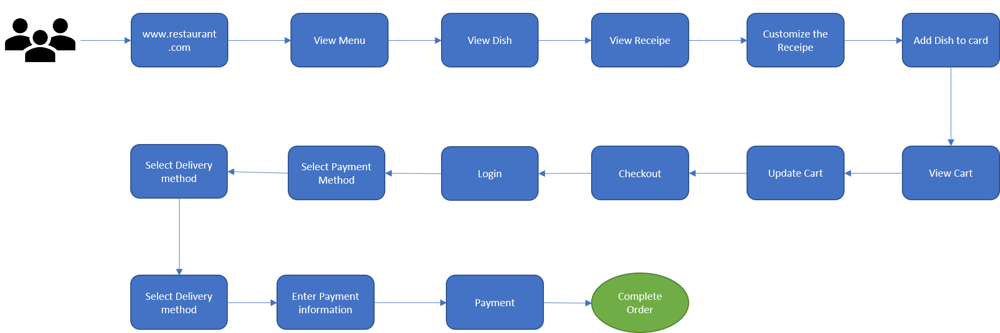
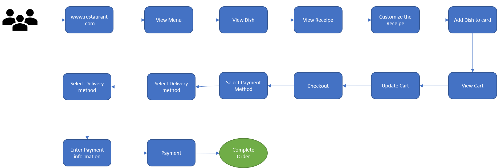
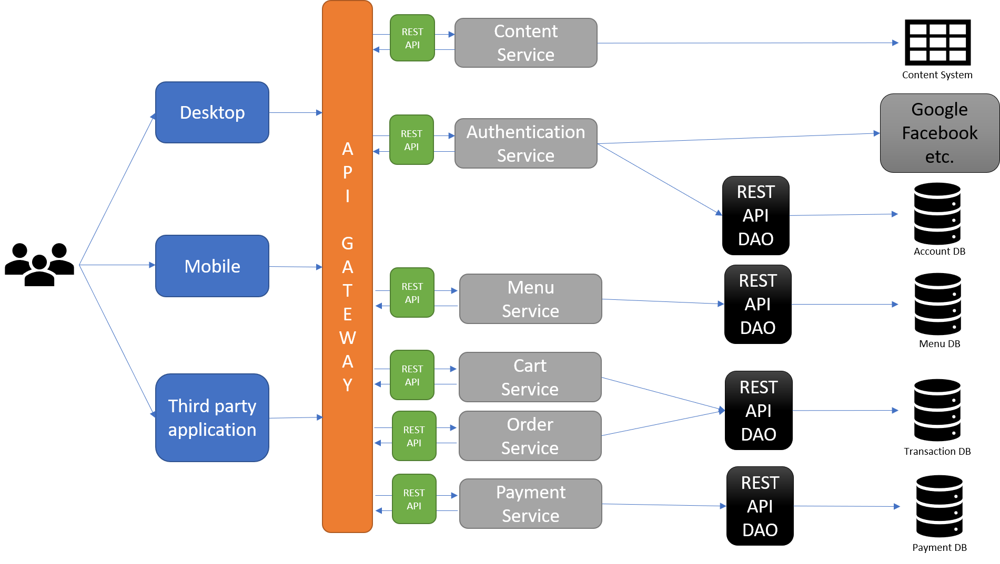

# Restaurant System

## Problem Statement:
Design and implement the services and their interfaces of a restaurant. What changes (services and interfaces) would you introduce to make the restaurant a more viable business during the Pandemic. Illustrate your design showing the services as a diagram and commit a skeleton implementation to your account in github.com
___
## Tentative solution:
User interaction journey look like.
 
As soon as user visit the restaurant system below are the different activities user can perform.
There are two kind of users
1) Restaurant User
2) Guest User 
____
### Existing Restaurant User
Typical Existing user flow: 
____
### Guest User
Typical System user flow: 
____
### Service interaction design

### Service API information

##### Authentication Service
| API Name | API Description | Endpoint | HTTP Method |
| Authentication | API is used to authenticate user | /restaurant/users/authenticate | POST |

