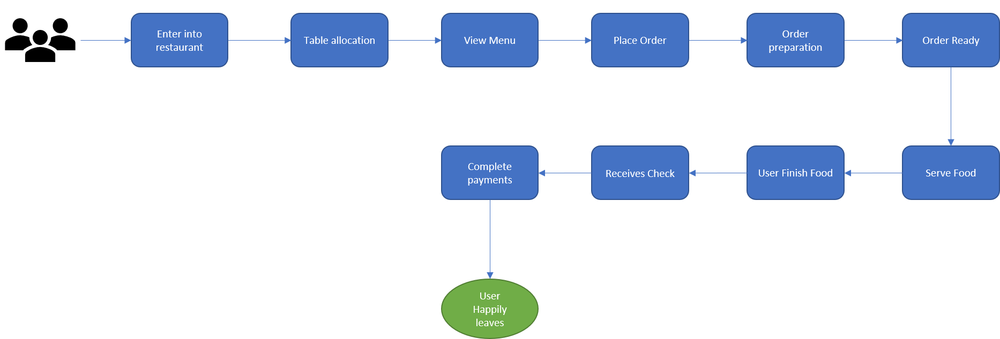
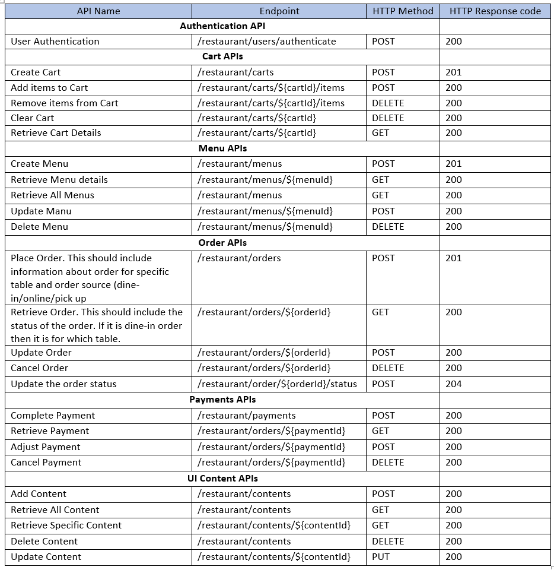

# Restaurant System

## Problem Statement:
Design and implement the services and their interfaces of a restaurant. What changes (services and interfaces) would you introduce to make the restaurant a more viable business during the Pandemic. Illustrate your design showing the services as a diagram and commit a skeleton implementation to your account in github.com
___
## Dine-in Process:
User interaction journey look like for Dine-in: 

Assumption: Restaurent is not offering online orders.

___
## Propose solution After Pandemic:

Below Two changes can make the restaurant a more viable business during the Pandemic.

1) Add two delivery method within restaurant. Order pickup and Order Delivery. 
2) Enhance the restaurant web application to place order online which can offer Order pickup and Order Delivery methods.

It can be enabled by adding new attribute "deliveryMethod" in order request object while placing order. Rest of the flow should be the same. Based on deliveryMethod restaurent worker can deliver the order.
____
### Application User Flow

____
### Guest User Flow

____
### Service interaction design

____
### Service API information

